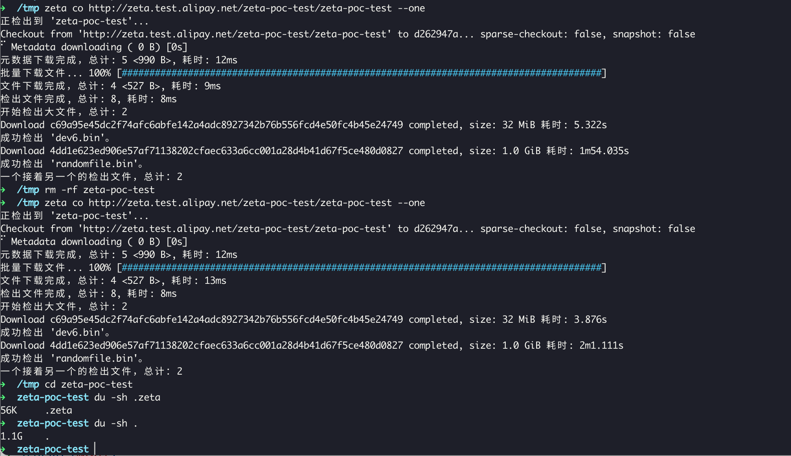

# HugeSCM - A next generation cloud-based version control system

[](LICENSE)
[](https://github.com/antgroup/hugescm/actions)
[](https://github.com/antgroup/hugescm/releases/latest)
[](https://github.com/antgroup/hugescm/releases)
[](https://github.com/antgroup/hugescm/releases/latest)

[简体中文](./README.zh-CN.md)

## Overview

HugeSCM (codename zeta) is a cloud-based, next-gen version control system addressing R&D repository size issues. It effectively manages both large repositories and individual large files, overcoming limitations of traditional centralized (like Subversion) and distributed systems (like Git) concerning storage and transmission. Designed for modern R&D needs, HugeSCM separates data storage: it keeps directory structures and commit records in a distributed database, while file content resides in a distributed file system or object storage. Unlike attempts to adapt Git to OSS, HugeSCM aims for optimal performance by avoiding common pitfalls. It's particularly suited for single large library R&D, AI model development, and game or driver development.

HugeSCM mainly solves the repository scale problem in the following ways:
+ Data separation principle: HugeSCM adopts the principle of data separation to divide the data of the version control system into metadata and file data, and stores them according to different strategies, solving the upper limit of single-machine file storage.
+ Efficient transmission protocol: HugeSCM adopts an efficient transmission protocol to reduce the time and bandwidth consumption of data transmission by optimizing the data transmission process. This enables HugeSCM to quickly and reliably handle version control operations of large-scale repositories.
+ Advanced algorithms and data structures: HugeSCM uses advanced algorithms and data structures to organize and manage repository data. These algorithms and data structures can effectively handle the storage and retrieval requirements of large-scale repositories and improve the efficiency and performance of operations. HugeSCM introduces fragments objects to solve the scale problem of a single file. This means that in addition to storing source code, HugeSCM can also conveniently store binary data, AI models, binary dependencies, and so on.
Through the above strategies and technologies, HugeSCM can effectively solve the repository scale problem and provide high-performance, reliable and flexible version control services.

## Technical Details

Object format: [object-format.md](./docs/object-format.md)  
Transport Protocol: [protocol.md](./docs/protocol.md)

## Build

After installing the latest version of Golang, developers can build HugeSCM client. They can choose to install make or [bali](https://github.com/balibuild/bali) (build packaging tool).

```sh
bali -T windows
# create rpm,deb,tar,sh pack
bali -T linux -A amd64 --pack='rpm,deb,tar,sh'
```

The bali build tool can create `zip`, `deb`, `tar`, `rpm`, `sh (STGZ)` compression/installation packages.

## Windows Installation Package

We have written an Inno Setup package script. You can use Docker + wine to generate an installation package without Windows. You can run `amake/innosetup` to make an Inno Setup installation package:

```shell
docker run --rm -i -v "$TOPLEVEL:/work" amake/innosetup xxxxx.iss
```

Then you can generate the installation package. Before that, we need to run `bali --target=windows --arch=amd64` to build the Windows platform binary.

Note: On a macOS machine with an Apple Silicon chip, you can use Orbstack to open Rosetta and run the image to make a Windows installation package.

## Use

Users can run `zeta -h` to view all zeta commands, and run `zeta ${command} -h` to view detailed command help. We try to make it easy for git users to get started with zeta, and we will also enhance some commands. For example, many zeta commands support `--json` to format the output as json, which is convenient for integration with various tools.

### Config

```shell
zeta config --global user.email 'zeta@example.io'
zeta config --global user.name 'Example User'
```

### Checkout

The process to obtain a remote repository in git is called `clone` (or `fetch`). In zeta, we use `checkout`, abbreviated as `co`. Below is how to `checkout` a repository.:

```shell
zeta co http://zeta.example.io/group/repo xh1
zeta co http://zeta.example.io/group/repo xh1 -s dir1
```

### Track and Commit

We have implemented git-like `status`, `add`, and `commit` commands, usable except in interactive mode. Use `-h` for help. On properly configured systems, zeta displays the corresponding language version.

```shell
echo "hello world" > helloworld.txt
zeta add helloworld.txt
zeta commit -m "Hello world"
```
### Push and Pull

```shell
zeta push
zeta pull
```

## Features

### Download acceleration

The zeta client supports three acceleration types—`direct`, `dragonfly`, and `aria2`—configurable via `core.accelerator` or the `ZETA_CORE_ACCELERATOR` environment variable.

| accelerator | mechanism | remark |
| :---: | --- | --- |
| `direct` | The zeta client directly retrieves the signature address from OSS, bypassing the Zeta Server. | **<font style="color:#ED740C;">This mechanism is applicable in AI scenarios. After OSS downloads with signatures, speed is adequate. Without an accelerator, download speed may be suboptimal. Users should enable direct connection unless the OSS signature URL is inaccessible.</font>** |
| `dragonfly` | Use the dragonfly client dfget to download, leveraging dragonfly cluster capabilities. | You can use `ZETA_EXTENSION_DRAGONFLY_GET` to specify the dfget path instead of using the dfget in PATH.|
| `aria2` | Use the aria2c command line to download; aria2 is a well-known download tool in the industry. | You can use `ZETA_EXTENSION_ARIA2C` to specify the aria2c path instead of using the aria2c in PATH. |

```shell
# oss direct
zeta config --global core.accelerator direct
```

By default, parallel download support is disabled, regardless of whether the accelerator is on or off. Users can configure `core.concurrenttransfers` (environment variable `ZETA_CORE_CONCURRENT_TRANSFERS`) to set the number of concurrent downloads, with valid values between *1-50*. When enabled, the benefits of concurrent downloads may not be very noticeable, typically due to bandwidth limitations.

### One by One Checkout

Previously, downloading a model file from a 100GB repository using Git LFS could require over 300GB of storage space, including 100GB for the model files, 100GB for split files, and 100GB for Git LFS objects. This often resulted in download failures due to insufficient disk space. With the introduction of the `zeta co url --one` mechanism in Zeta, we can check out a file and immediately delete the corresponding blob object, allowing a 100GB model file to ultimately occupy just a bit over 100GB, saving over **60%** of space.

```shell
zeta co http://zeta.example.io/zeta-poc-test/zeta-poc-test --one
```



We added a `Size` field to the `TreeEntry` in our object model design, allowing us to easily implement an API to estimate the storage space required for checking out a model repository. This, combined with a `one-by-one` checkout mechanism, effectively saves disk space.

### On-demand Access

Initially, zeya only supported downloading objects related to specific commits and allowed the deletion of related blobs after checkout. However, user scenarios turned out to be complex. We introduced automatic downloading of missing objects for `zeta cat`. If you want to disable this feature, set the environment variable `ZETA_CORE_PROMISOR=0`. Additionally, we've implemented automatic downloading of missing objects for merge scenarios as well.

### Checkout single file

In zeta, you can checkout a single file by adding `--limit=0` during the checkout process, which excludes all files except empty ones. Then, use `zeta checkout -- path` to check out the specific file.

```shell
zeta co http://zeta.example.io/zeta-poc-test/zeta-poc-test --limit=0 z2
zeta checkout -- dev6.bin
```

### Update some files

Some users may only want to modify specific files, which can be done by using `checkout single file` to checkout the desired file and then making the modifications.

```shell
zeta add test1/2.txt
zeta commit -m "XXX"
zeta push
```

### Migrate repository from Git to HugeSCM

```shell
zeta-mc https://github.com/antgroup/hugescm.git hugescm-dev
```


## License

Apache License Version 2.0, see [LICENSE](LICENSE)