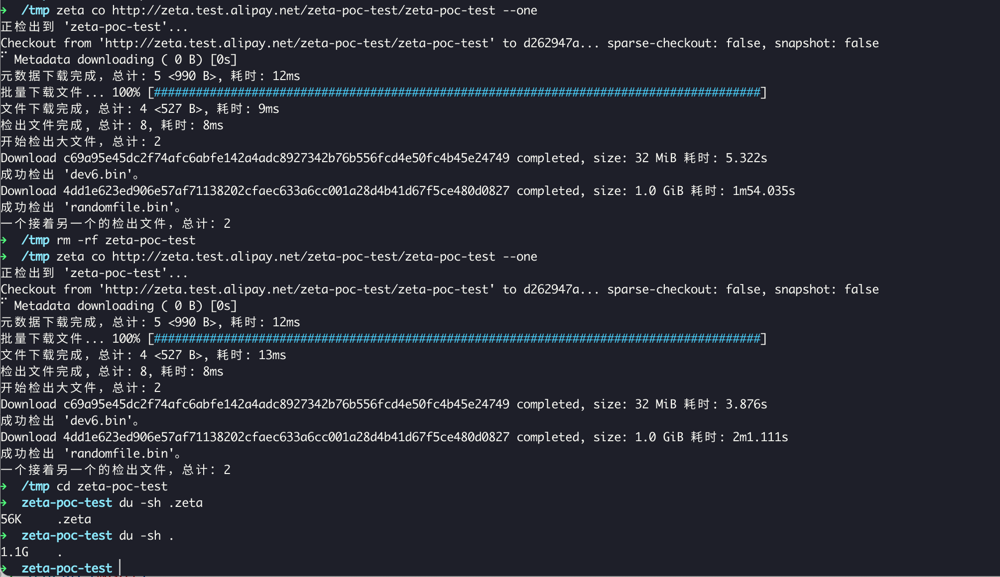

# HugeSCM - 基于云的下一代版本控制系统

[](LICENSE)
[](https://github.com/antgroup/hugescm/actions)
[](https://github.com/antgroup/hugescm/releases/latest)
[](https://github.com/antgroup/hugescm/releases)
[](https://github.com/antgroup/hugescm/releases/latest)

[English](./README.md)

## 概述

HugeSCM（内部代号 zeta）是一种基于云的下一代版本控制系统，旨在解决研发过程中存储库规模问题。它既能处理单一存储库体积巨大的挑战，也能应对存储单一文件巨大的问题。相比于传统的集中式版本控制系统（如 Subversion）和传统的分布式版本控制系统（如 Git），HugeSCM 不受存储架构和传输协议的限制。随着研发活动的推进，传统的版本控制系统已经无法满足巨型存储库的需求，这就是 HugeSCM 诞生的原因。

HugeSCM 是一种数据分离的版本控制系统，目录结构、提交记录、分支信息存储在分布式数据库中，而文件内容则存储在分布式文件系统或者对象存储中。国内外的开发者曾将 Git 对象存储到 OSS/分布式文件系统中，对 git 架构进行改造，但效果非常差。HugeSCM 需要吸取这些教训，对其架构进行精心设计，避免因存储数据到 DB/OSS 带来的性能下降问题。

HugeSCM 适合单一大库研发，特别是 AI 大模型研发，以及游戏研发、驱动开发等场景。

HugeSCM 主要通过以下方式解决存储库规模问题：
+ **数据分离原则**：HugeSCM 采用数据分离的原则，将版本控制系统的数据分为元数据和文件数据，按照不同的策略存储，解决了单机文件存储的上限。
+ **高效传输协议**：HugeSCM 采用高效的传输协议，通过优化数据传输过程，减少数据传输的时间和带宽消耗。这使得 HugeSCM 能够快速而可靠地处理大规模存储库的版本控制操作。
+ **先进的算法和数据结构**：HugeSCM 使用先进的算法和数据结构来组织和管理存储库的数据。这些算法和数据结构能够有效地处理大规模存储库的存储和检索需求，提高操作的效率和性能。HugeSCM 引入了 fragments 对象，解决了单一文件的规模问题。这意味着 HugeSCM 除了可以存储源代码，还可以方便的存储二进制数据、AI 模型、二进制依赖等等。

通过以上策略和技术，HugeSCM 能够有效地解决存储库规模问题，提供高性能、可靠和灵活的版本控制服务。

**它吸取了 Git 的经验，摆脱了 Git 的历史包袱，总之我们感谢这些前辈。**

## 适用场景

### AI 大模型研发

- 存储 checkpoint 文件（数十 GB 到数百 GB）
- 模型版本管理和增量更新
- 多团队协作

### 游戏研发

- 大型二进制资源管理
- 美术资产版本控制

### 数据集存储

- 大规模数据集版本管理
- 数据标注协作

## 文档

### 设计与架构

| 文档 | 描述 |
|------|------|
| [desgin.md](./docs/desgin.md) | 设计哲学 - 核心设计理念、架构概述、与 Git 的差异 |
| [object-format.md](./docs/object-format.md) | 对象格式详解 - Blob、Tree、Commit、Fragments 等对象的二进制格式 |
| [pack-format.md](./docs/pack-format.md) | Pack 文件格式 - 对象打包机制和索引格式 |
| [protocol.md](./docs/protocol.md) | 传输协议规范 - HTTP/SSH 协议、授权、元数据和文件传输 |
| [version-negotiation.md](./docs/version-negotiation.md) | 版本协商机制 - 基线管理、检出、拉取、推送流程 |

### 配置参考

| 文档 | 描述 |
|------|------|
| [config.md](./docs/config.md) | 配置文件说明 - 支持的配置项和环境变量 |

### 功能使用

| 文档 | 描述 |
|------|------|
| [switch.md](./docs/switch.md) | 分支切换 - switch 命令详解，切换分支和提交 |
| [stash.md](./docs/stash.md) | 暂存功能 - stash 命令详解，临时保存工作进度 |
| [sparse-checkout.md](./docs/sparse-checkout.md) | 稀疏检出 - 按需检出指定目录 |
| [pull-strategy.md](./docs/pull-strategy.md) | 拉取策略 - merge、rebase、fast-forward 策略详解 |

### 高级特性

| 文档 | 描述 |
|------|------|
| [cdc.md](./docs/cdc.md) | CDC 分片 - Content-Defined Chunking 实现原理和配置 |

## 构建

开发者安装好最新版本的 Golang 后，可以使用 [bali](https://github.com/balibuild/bali)（构建打包工具）构建 HugeSCM 客户端。

```sh
bali -T windows
# create rpm,deb,tar,sh pack
bali -T linux -A amd64 --pack='rpm,deb,tar,sh'
```

bali 构建工具可以制作 `zip`, `deb`, `tar`, `rpm`, `sh (STGZ)` 压缩/安装包。

### Windows 安装包

我们提供了 Inno Setup 脚本，可以使用 Docker + wine 在非 Windows 环境下生成安装包：

```shell
docker run --rm -i -v "$TOPLEVEL:/work" amake/innosetup xxxxx.iss
```

运行前请先构建 Windows 二进制：`bali --target=windows --arch=amd64`。

> 注意：在搭载 Apple Silicon 芯片的 macOS 上，可以使用 OrbStack 开启 Rosetta 运行该镜像。

## 使用

用户可以运行 `zeta -h` 查看 zeta 所有命令，并运行 `zeta ${command} -h` 查看命令详细帮助，我们尽量让使用 git 的用户容易上手 zeta，同时也会对一些命令进行增强，比如很多 zeta 命令支持 `--json` 将输出格式化为 json，方便各种工具集成。

### 配置

```shell
zeta config --global user.email 'zeta@example.io'
zeta config --global user.name 'Example User'
```

### 检出存储库

使用 git 获取远程存储库的操作叫 `clone`（当然也可以用 `fetch`），在 zeta 中，我们限制其操作为 `checkout`，你也可以缩写为 `co`，以下是检出一个存储库：

```shell
zeta co http://zeta.example.io/group/repo xh1
zeta co http://zeta.example.io/group/repo xh1 -s dir1
```

### 修改、跟踪、提交

我们实现了类似 git 一样的 `status`、`add`、`commit` 命令，除了交互模式外，大体上是可用的，可以使用 `-h` 查看详细帮助，在正确设置了语言环境的系统中，zeta 会显示对应的语言版本。

```shell
echo "hello world" > helloworld.txt
zeta add helloworld.txt
zeta commit -m "Hello world"
```

### 推送和拉取

```shell
zeta push
zeta pull
```

## 特点

### 下载加速

目前 zeta 客户端支持三种类型的加速，可以通过修改配置 `core.accelerator` 或者覆盖环境变量 `ZETA_CORE_ACCELERATOR`，支持的值有 `direct`、`dragonfly`、`aria2`。

| 加速器 | 加速逻辑 | 备注 |
| :---: | --- | --- |
| `direct` | 由 zeta 客户端获取签名地址直接从 OSS 下载，流量不经 Zeta Server | AI 场景可以使用该机制，实际上 oss 走签名下载后，速度是足够的。相反，如果未设置加速器，下载网速可能达不到理想状态，因此，用户应当尽量开启直连（当无法访问 oss 签名 url 时，则不应设置）。|
| `dragonfly` | 调用 dragonfly 客户端 dfget 下载，dfget 能使用 dragonfly 集群能力。 | 可以使用 `ZETA_EXTENSION_DRAGONFLY_GET` 指定 dfget 路径，而不是使用 PATH 中的 dfget。  |
| `aria2` | 调用 aria2c 命令行下载，aria2 是业内著名的下载工具。 | 可以使用 `ZETA_EXTENSION_ARIA2C` 指定 aria2c 路径，而不是使用 PATH 中的 aria2c。  |

```shell
# 开启 oss 直连下载
zeta config --global core.accelerator direct
```

默认情况下，无论是开启了加速器还是未开启加速器，我们都未开启并行下载支持，用户可以配置 `core.concurrenttransfers`（环境变量 `ZETA_CORE_CONCURRENT_TRANSFERS`）设置并发下载数，有效值是 `1-50`，当你开启了并发下载，你会发现收益可能并不是那么明显，这通常会受带宽影响。

### 逐一检出

以前 Git LFS 在下载模型时，模型文件总容量为 100GB 的仓库可能需要超过 300GB 的存储空间，其中模型文件 100GB，分割后的文件 100GB，Git LFS 对象（`.git/lfs/objects/xx/...`）100GB，很多时候如果磁盘空间不够，将无法下载模型，在 zeta 中我们引入了 `zeta co url --one` 机制，检出一个文件立即删除相应的 blob 对象，这样 100GB 的模型文件，最终占用的空间可能也就 100GB 多一点，空间节省 60% 以上。

```shell
zeta co http://zeta.example.io/zeta-poc-test/zeta-poc-test --one
```



我们在设计对象模型时还为 TreeEntry 增加了 `Size` 字段，这使得我们可以很容易实现一个 API 预估模型存储库检出所需空间大小，结合逐一检出机制，能够很好的节省磁盘空间。

### 按需获取

zeta 在设计之初是仅支持下载特定 commit 相关的对象，也支持 checkout 后删除相关的 blob，但事实证明用户的场景是复杂的，我们为 `zeta cat` 引入了自动下载缺失的对象，截图如下（不确定对象大小，可以使用 zeta cat --limit 或者 zeta cat -s 避免大文件输出到终端）。

如要禁用自动下载缺失的对象，可设置环境变量 `ZETA_CORE_PROMISOR=0` 禁用该功能。此外，我们还为 merge 等场景引入了自动下载缺失的对象功能。

### 稀疏检出

稀疏检出允许用户只检出存储库中的部分目录，而非完整的工作区。这对于巨型存储库特别有用：

```shell
# 检出指定目录
zeta co http://zeta.example.io/group/repo myrepo -s src/core -s src/utils
```

### 检出单个文件

我们在 zeta 中可以检出单个文件，只需要在 co 的过程中添加 `--limit=0` 意味着除了空文件其他文件均不检出，然后使用 zeta checkout -- path 检出相应的文件即可：

```shell
zeta co http://zeta.example.io/zeta-poc-test/zeta-poc-test --limit=0 z2
zeta checkout -- dev6.bin
```

### 更新部分文件

有些用户仅想修改部分文件，同样可以做到，使用**检出单个文件**检出特定的文件后，修改后执行：

```shell
zeta add test1/2.txt
zeta commit -m "XXX"
zeta push
```

### 拉取策略

HugeSCM 支持三种拉取策略：

- **merge** - 创建合并提交（默认）
- **rebase** - 将本地提交变基到远程分支之上
- **fast-forward only** - 仅允许快进合并

```shell
zeta pull                    # merge 策略（默认）
zeta pull --rebase           # rebase 策略
zeta pull --ff-only          # 仅快进合并
```

### 暂存功能

暂存功能允许临时保存工作进度：

```shell
zeta stash                   # 暂存所有修改
zeta stash save "WIP: 功能开发中"  # 带描述信息暂存
zeta stash list              # 列出所有暂存
zeta stash pop               # 应用并删除最近的暂存
```

### 分支切换

在不同分支或提交之间切换：

```shell
zeta switch feature          # 切换到分支
zeta switch -c new-feature   # 创建并切换到新分支
zeta switch abc123           # 切换到特定提交
```

### 将存储库从 Git 迁移到 HugeSCM

```shell
zeta-mc https://github.com/antgroup/hugescm.git hugescm-dev
```

## CDC（内容定义分片）

HugeSCM 引入了 CDC 用于高效处理大文件。与传统的固定大小分片不同，CDC 根据内容确定分片边界，实现更好的去重效果：

| 场景 | 固定分片 | CDC 分片 |
|------|---------|---------|
| 局部修改 | 所有后续分片改变 | 仅 1-2 个分片改变 |
| 增量同步 | 传输完整文件 | 仅传输变化分片 |
| 去重效果 | 低 | 高 |

启用 CDC 配置：

```toml
[fragment]
threshold = "1GB"      # 文件大小阈值
size = "1GB"           # 目标分片大小（固定分片）
enable_cdc = true      # 启用 CDC 分片
```

## 与 Git 的主要差异

| 特性 | Git | HugeSCM |
|-----|-----|---------|
| 架构模式 | 分布式 | 集中式 |
| 克隆方式 | 全量克隆 | 按需检出 |
| 哈希算法 | SHA-1/SHA-256 | BLAKE3 |
| 大文件支持 | Git LFS | 内置 Fragments |
| 数据存储 | 本地文件系统 | DB + OSS |

### 命令对照

| Git 命令 | HugeSCM 命令 | 说明 |
|---------|-------------|------|
| `git clone` | `zeta checkout` (co) | 检出存储库，非全量克隆 |
| `git fetch` | `zeta pull --fetch` | 仅获取数据 |
| `git pull` | `zeta pull` | 拉取并合并 |
| `git switch` | `zeta switch` | 切换分支 |

## 额外的工具 - hot 命令

`hot` 是整合到 HugeSCM 中的 **Git 存储库维护工具**，专用于存储库治理和优化。它帮助开发者高效地清理、维护和迁移 Git 存储库。

### 为什么需要 hot？

Git 存储库在长期使用中会积累技术债务——误提交的敏感数据、膨胀的大文件、过期的分支、落后的对象格式等。`hot` 正是为解决这些问题而生：

| 挑战 | hot 解决方案 |
|------|-------------|
| 历史中的敏感数据 | `hot remove` 重写历史，彻底删除敏感信息 |
| 存储库膨胀 | `hot size`/`hot smart` 识别并清理大文件 |
| SHA1 安全问题 | `hot mc` 迁移到 SHA256 对象格式 |
| 过期分支/标签 | `hot prune-refs`/`hot expire-refs` 自动清理 |
| 开源发布准备 | `hot unbranch` 创建干净的公开历史 |

### 主要功能

| 命令 | 描述 |
|------|------|
| `hot size` | 查看存储库大小和大文件（原始大小） |
| `hot az` | 分析大文件的近似压缩大小 |
| `hot remove` | 删除存储库中的文件并重写历史 |
| `hot smart` | 交互式清理大文件（结合 `size` 和 `remove` 命令） |
| `hot graft` | 交互式清理大文件（嫁接模式） |
| `hot mc` | 迁移存储库对象格式（SHA1 ↔ SHA256） |
| `hot unbranch` | 线性化存储库历史（移除合并提交） |
| `hot prune-refs` | 按前缀清理引用 |
| `hot scan-refs` | 扫描本地存储库中的引用 |
| `hot expire-refs` | 清理过期引用 |
| `hot snapshot` | 为工作树创建快照提交 |
| `hot cat` | 查看存储库对象（commit/tree/tag/blob） |
| `hot stat` | 查看存储库状态 |
| `hot co` | 克隆存储库（实验性） |

### 常见使用场景

**1. 查找大文件**
```shell
hot size                    # 查看大文件的原始大小
hot az                      # 查看近似压缩大小
hot smart -L20m             # 交互模式，筛选 >= 20MB 的文件
```

**2. 删除敏感数据**
```shell
# 删除误提交的密码凭证并重写历史
hot remove path/to/secret.txt
hot remove "*.env" --confirm --prune
```

**3. 迁移对象格式**
```shell
# 从 SHA1 迁移到 SHA256
hot mc https://github.com/user/repo.git

# 或迁移本地存储库
hot mc /path/to/repo --format sha256
```

**4. 清理过期引用**
```shell
# 先扫描引用
hot scan-refs

# 按前缀删除引用
hot prune-refs "feature/deprecated-"

# 删除过期引用
hot expire-refs --days 90
```

**5. 线性化历史**
```shell
# 移除所有合并提交，使历史线性化
hot unbranch --confirm

# 创建保留最近历史的孤儿分支（适用于开源场景）
hot unbranch -K1 master -T new-branch
```

**6. 查看对象**
```shell
# 以 JSON 格式查看 commit/tree/tag
hot cat HEAD --json

# 查看文件内容（二进制文件以 16 进制显示）
hot cat HEAD:docs/images/blob.png
```

比如你查看仓库中的一张图片（二进制文件按照 16 进制展示）：


比如你查看仓库的信息：


将 Git 存储库对象格式从 SHA1 迁移到 SHA256：


## 许可证

Apache License Version 2.0, 请查看 [LICENSE](LICENSE)