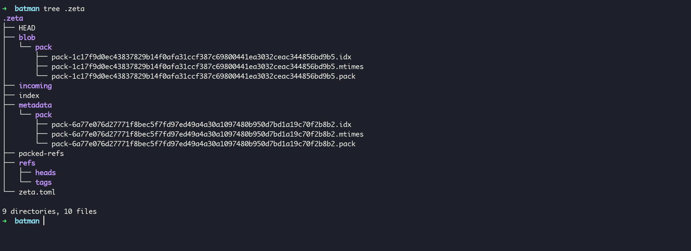
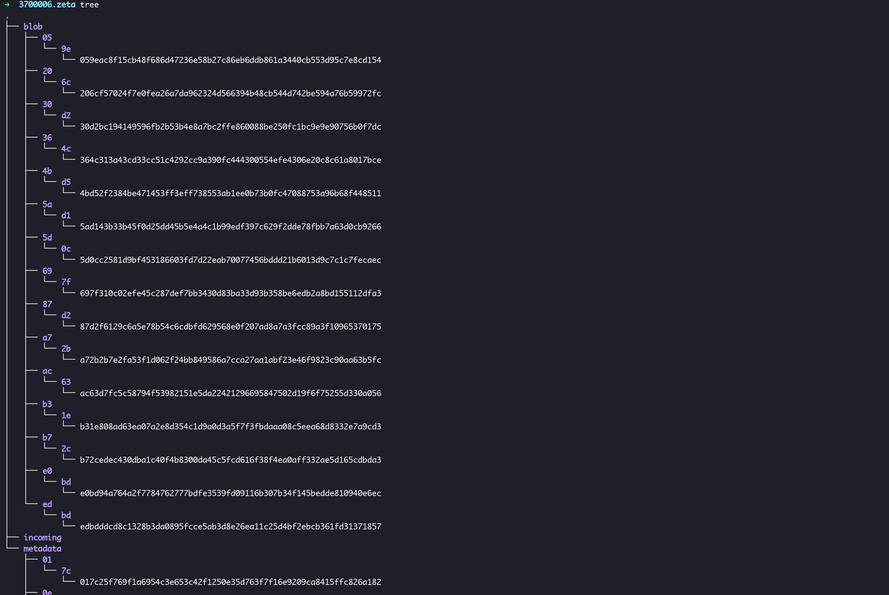
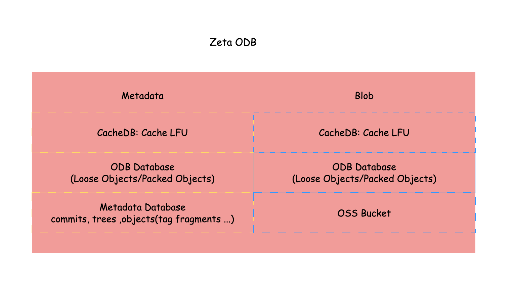
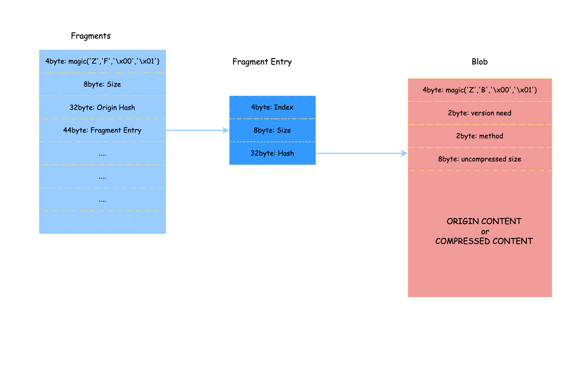
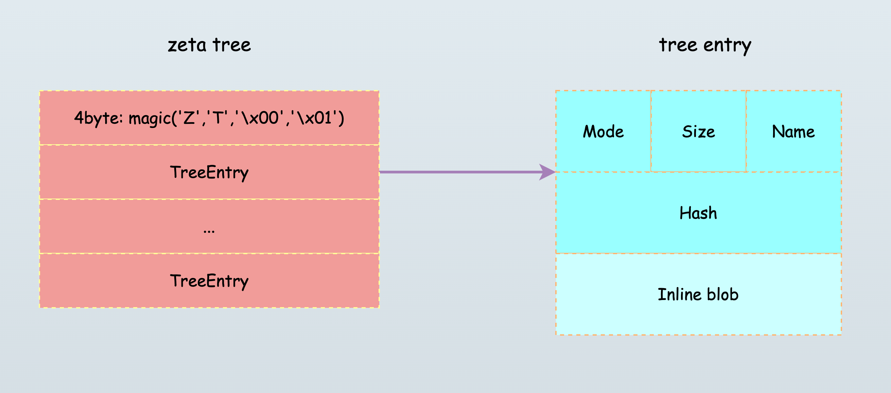
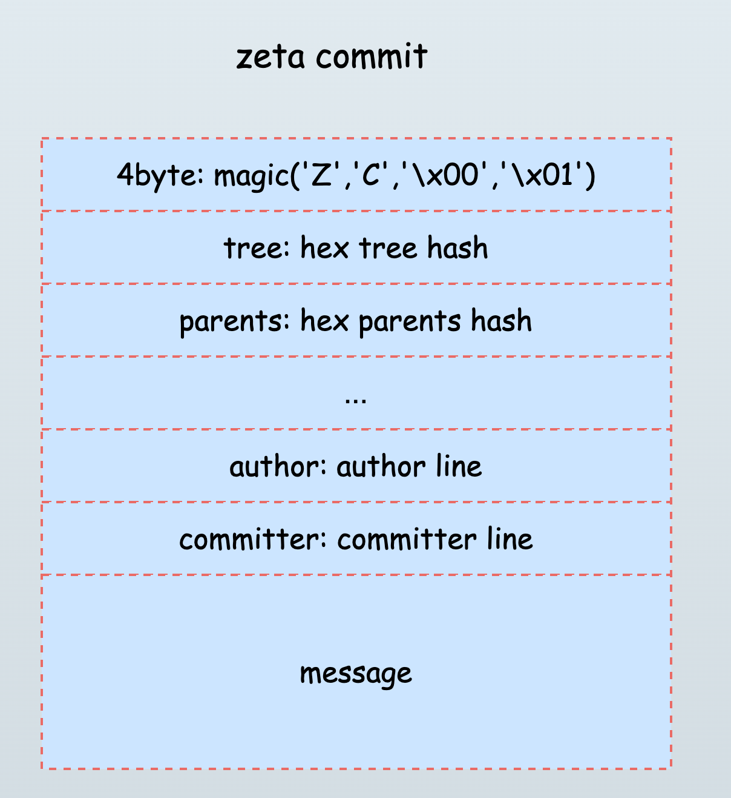

# HugeSCM 对象格式与存储规范

## 一、前言
### 1.1 术语和定义
元数据（Metadata）：提交（commit），以及目录（tree），切片（fragments）。

元数据数据库：由分布式关系型数据库存储版本控制系统的元数据。

存储库：存储库是特定的元数据和文件的集合。

分支：Branch，分支是大多数版本控制系统中可用的功能，它是独立的开发线，Branch 记录 Commit 的 16 进制哈希值。

提交：Commit，指存储库特定的一次快照，commit 与其父 commit 相比，可计算出本次变更的内容，commit 记录根 Tree 的哈希值。

目录：Tree，指存储库特定的目录结构元数据，Tree 由若干个 TreeEntry 组成，TreeEntry 通过 Hash 引用到 Tree 或者 Blob。

分片：Fragments，HugeSCM 中特殊的对象，纳入版本控制时，将一个特别巨大的文件拆分成多部分，检出时将多个部分合并为一个文件，切片的引入解决了 AI 研发的单个文件体积限制问题。

BLOB：用于保存文件数据的对象格式。

引用：分支（Branch）和标签 （Tag）

## 二、对象的存储
在 HugeSCM 中，我们引入了数据分离的设计，即文件对象 blob 单独存储，而像目录结构（tree），提交（commit），以及其他扩展对象，比如切片（fragments），tag 对象（兼容 Git）则作为元数据另外存储，而引用，包括分支（branch），标签（tag）又另外存储，对于本地存储库快照和服务端，我们的存储细节又不一样，归根结底，这些不同的设计都是为了支撑 HugeSCM 的愿景。

### 2.1 本地存储库目录布局
我们将 HugeSCM 存储库在本地的部分集合称之为存储库的本地快照，包含工作目录和存储库目录，其目录结构如下：



1. 本地存储库分为工作目录，即 `.zeta`的父目录，不包含 `.zeta`本身。
2. `.zetaignore`用于从版本控制中排除特定的文件。
3. `.zattributes`属性文件，后续可能有助于 AI 场景。

存储库目录为 `.zeta`，包含如下目录和文件：

+ zeta.toml 存储库配置数据，在客户端兼容规范中定义。
+ `packed-refs`, `refs/` 引用文件，用于存储本地分支，标签，及其变更记录。
+ index 当前工作目录检出，纳入变更的索引。
+ metadata 松散/打包的元数据。
+ blob 松散/打包的 blob 数据。

配置文件 zeta.toml 示例如下：

```toml
[core]
remote = "https://zeta.io/group/mono-zeta"
sparse = ["miracle"]
compression-algo = "zstd"
```

+ remote 即远程存储库地址。
+ sparse 当前仓库检出的路径。
+ compression-algo 压缩算法

当用户修改了 refs 之后，name 是分支和标签的全名，hash 是当前的提交，baseline 则代表从哪个 commit 开始创建该分支，在更新分支/标签时需要 `updated_at`。

+ 分支使用 `refs/branches/`前缀。
+ 标签使用 `refs/tags/`前缀。
+ 分支和标签均不能以这些前缀开头。
+ HugeSCM 在设计上没有支持多 remote。

### 2.2 服务端存储布局
HugeSCM 为了解决巨型存储库存在海量 commit/tree/blob 的问题，会将这些数据按照约定存储到服务端的磁盘上，这里的约定如下：

+ 元数据，即 commit 和 tree，可以在服务端的磁盘中保持完整的数据集。
+ 当服务端内存容量较为充足时，可以在服务端的内存中保持最新的元数据缓存，缓存算法自选。
+ 文件，即 Blob，但大小小于一定限制，比如 16K，可以将其存储在服务端的磁盘中。
+ 服务端接受到用户请求后，先内存，后磁盘，最后才是 DB/OSS 等后端。
+ 服务端可以实现缓存同步机制，将缓存同步到新的实例。

服务端磁盘缓存参考目录结构：



服务端 ODB 层次结构如下图：



### 2.3 服务端 MDB 表
**commits** 表，存储 commit 对象：

```sql
CREATE TABLE
    `commits` (
        `id` bigint (20) unsigned NOT NULL AUTO_INCREMENT comment '主键',
        `rid` bigint (20) unsigned NOT NULL comment '仓库 ID',
        `hash` char(64) NOT NULL DEFAULT '' comment '提交哈希值',
        `author` varchar(512) NOT NULL DEFAULT '' comment '作者邮箱',
        `committer` varchar(512) NOT NULL DEFAULT '' comment '提交者邮箱',
        `bindata` mediumblob NOT NULL comment '编码对象',
        `created_at` timestamp NOT NULL DEFAULT CURRENT_TIMESTAMP comment '创建时间，以 author when 填充',
        `updated_at` timestamp NOT NULL DEFAULT CURRENT_TIMESTAMP COMMENT '修改时间，以 committer when 填充',
        PRIMARY KEY (`id`),
        UNIQUE KEY `uk_commits_rid_hash` (`rid`, `hash`) LOCAL,
        KEY `idx_commits_rid` (`rid`) LOCAL,
        KEY `idx_commits_author` (`author`) LOCAL,
        KEY `idx_commits_committer` (`committer`) LOCAL
    ) DEFAULT CHARSET = utf8mb4 COLLATE = utf8mb4_general_ci COMMENT = '提交表';
```

**trees** 表，存储 tree 对象：

```sql
CREATE TABLE
    `trees` (
        `id` bigint (20) unsigned NOT NULL AUTO_INCREMENT comment '主键',
        `rid` bigint (20) unsigned NOT NULL comment '存储库 ID',
        `hash` char(64) NOT NULL comment 'tree 哈希值 - 16 进制',
        `bindata` mediumblob NOT NULL comment '编码对象',
        `created_at` timestamp NOT NULL DEFAULT CURRENT_TIMESTAMP comment '创建时间',
        `updated_at` timestamp NOT NULL DEFAULT CURRENT_TIMESTAMP ON UPDATE CURRENT_TIMESTAMP comment '修改时间',
        PRIMARY KEY (`id`),
        UNIQUE KEY `uk_trees_rid_hash` (`rid`, `hash`) LOCAL,
        KEY `idx_trees_rid` (`rid`) LOCAL
    ) AUTO_INCREMENT = 1 DEFAULT CHARSET = utf8mb4 COLLATE = utf8mb4_general_ci COMMENT = 'tree 表';
```

**objects** 表，存储 fragments 和 tag：

```sql

CREATE TABLE
    `objects` (
        `id` bigint (20) unsigned NOT NULL AUTO_INCREMENT comment '主键',
        `rid` bigint (20) unsigned NOT NULL comment '仓库 ID',
        `hash` char(64) NOT NULL DEFAULT '' comment '对象哈希值',
        `bindata` mediumblob NOT NULL comment '编码对象',
        `created_at` timestamp NOT NULL DEFAULT CURRENT_TIMESTAMP comment '创建时间',
        `updated_at` timestamp NOT NULL DEFAULT CURRENT_TIMESTAMP ON UPDATE CURRENT_TIMESTAMP comment '修改时间',
        PRIMARY KEY (`id`),
        UNIQUE KEY `uk_objects_rid_hash` (`rid`, `hash`) LOCAL,
        KEY `idx_objects_rid` (`rid`) LOCAL
    ) DEFAULT CHARSET = utf8mb4 COLLATE = utf8mb4_general_ci COMMENT = '扩展元数据对象表';
```


**分支**表：

```sql
CREATE TABLE
    `branches` (
        `id` bigint (20) unsigned NOT NULL AUTO_INCREMENT comment '主键',
        `name` varchar(4096) NOT NULL DEFAULT '' comment '分支名',
        `rid` bigint (20) unsigned NOT NULL comment '存储库 ID',
        `hash` char(64) NOT NULL DEFAULT '' comment '分支提交',
        `protection_level` int (11) NOT NULL DEFAULT '0' comment '保护分支级别，普通 0，保护分支 10，归档 20，隐藏分支 30',
        `created_at` timestamp NOT NULL DEFAULT CURRENT_TIMESTAMP comment '创建时间',
        `updated_at` timestamp NOT NULL DEFAULT CURRENT_TIMESTAMP ON UPDATE CURRENT_TIMESTAMP comment '修改时间',
        PRIMARY KEY (`id`),
        UNIQUE KEY `uk_branches_rid_name` (`rid`, `name`) LOCAL,
        KEY `idx_branches_rid` (`rid`) LOCAL
    ) DEFAULT CHARSET = utf8mb4 COLLATE = utf8mb4_general_ci COMMENT = '分支表';
```

**标签**表：

```sql
CREATE TABLE
    `tags` (
        `id` bigint (20) unsigned NOT NULL AUTO_INCREMENT comment '主键',
        `rid` bigint (20) unsigned NOT NULL comment '存储库 ID',
        `uid` bigint (20) unsigned NOT NULL DEFAULT '0' comment '创建者的 ID',
        `name` varchar(4096) NOT NULL comment '标签名',
        `hash` char(64) NOT NULL comment 'Tag 哈希值',
        `subject` varchar(1024) NOT NULL DEFAULT 'CURRENT_TIMESTAMP' comment 'Tag 标题',
        `description` mediumtext NOT NULL comment 'Tag 描述信息',
        `created_at` timestamp NOT NULL DEFAULT CURRENT_TIMESTAMP comment '创建时间',
        `updated_at` timestamp NOT NULL DEFAULT CURRENT_TIMESTAMP ON UPDATE CURRENT_TIMESTAMP comment '修改时间',
        PRIMARY KEY (`id`),
        UNIQUE KEY `uk_tags_rid_name` (`rid`, `name`) LOCAL,
        KEY `idx_tags_rid` (`rid`) LOCAL
    ) AUTO_INCREMENT = 1 DEFAULT CHARSET = utf8mb4 COLLATE = utf8mb4_general_ci COMMENT = '引用表';
```

此外，服务端并未支持其他类型引用，是否要支持，请根据实际功能选择是否添加。

## 三、对象的类型
### 3.1 文件
在 HugeSCM 中，用于保存文件数据的对象格式是 blob，这与 git 的概念是相同的，但 HugeSCM 的 blob 格式与 Git 有很大的区别，HugeSCM 借鉴了 ZIP 归档格式的机制，为 blob 引入了扩展压缩的能力。

我们计算文件内容的 BLAKE3 哈希值作为其 blob 对象的 ID，无论文件采用什么压缩格式，其对象 ID 是恒定的，blob 的格式如下：

1. 4 字节魔数，为 `'Z','B','\x00','\x01'`。
2. 2 字节解压版本，当前为 1。
3. 2 字节压缩算法。
4. 8 字节文件原始大小。
5. 可变长度的压缩内容。

请注意，我们使用大端，也就是网络字节序存储双字节以上的数据，下面是 blob 的结构图：


我们可以使用代码描述 blob 格式：

```cpp
enum compress_method : std::uint16_t {
  STORE = 0,   // Store as-is (without compression)
  ZSTD = 1,    // Use zstd compression
  BROTLI = 2,  // Use brotli compression
  DEFLATE = 3, // Use Deflate compression
  XZ = 4,      // Use xz compression
  BZ2 = 5,     // Use bzip2 compression
};

struct blob {
  std::byte magic[4];              // 'Z','B','\x00','\x01'
  std::uint16_t version_needed;    // version
  compress_method method;          // compress method
  std::uint64_t uncompressed_size; // uncompressed size
  std::byte *content;              // content
};


```

blob 保留的压缩格式：

+ 0 - STORE，即原样存储，不需要压缩，如果文件是压缩文件，二进制文件，体积较大，压缩的意义不大，那么我们可以选择原样存储，根据香浓信息论，压缩是有极限的，因此重复压缩并无必要，反而会浪费 CPU，现在的存储成本已经大大降低，没必要过度压缩。
+ 1 - ZSTD，ZSTD 是 facebook 推出的压缩算法，其压缩率和计算成本均衡性比较好，被许多的开源项目使用，包括 Linux 内核，以及 OB 数据库，在 HugeSCM 中，我们也优先使用 ZSTD。
+ 2 - BROTLI， Google 推出的压缩算法，保留。
+ 3 - DEFLATE，Git 使用的压缩算法，保留。
+ 4 - XZ，压缩率很高的压缩算法，保留。
+ 5 - BZ2，BZIP2 压缩算法，保留。

### 3.2 巨型文件
在 HugeSCM 中，我们将体积较大的文件切割成多个 blob 存储，将这些 blob 的长度，序号，哈希值存储到一个特殊的对象，即 **Fragments** 对象中，这样我们在上传，下载 blob 的时候能够避免因长时间的上传和下载带来的稳定性问题。降低了服务端的实现难度和网络稳定性带来的风险。

**Fragments** 对象自身，我们视其为 **Metadata** 的一种。



分片的二进制定义如下：

```go

type Fragment struct {
    Index uint32
    Size  uint64
    Hash  plumbing.Hash
}

type Fragments struct {
    Hash    plumbing.Hash // NOT Encode
    Size    uint64
    Origin  plumbing.Hash // origin file hash checksum
    Entries []Fragment
}

```

我们 `Fragments`对象进行编码，`Size`为原始内容的大小，`Origin`则是原始文件的哈希值，`Entries`则是分片记录，其字段如下：

+ Index 即分片的顺序，从 0 开始。
+ Size 分片的原始大小
+ Hash 分片的哈希

当我们将 Fragments 添加到 TreeEntry 时，其 Hash 应使用 Fragments 的哈希值，FileMode 添加掩码 `0400000`。

其编码如下：

```go

var (
	FRAGMENTS_MAGIC = []byte{'Z', 'F', 0x00, 0x01}
)

type Fragment struct {
	Index uint32
	Size  uint64
	Hash  plumbing.Hash
}

type Fragments struct {
	Hash    plumbing.Hash // NOT Encode
	Size    uint64
	Origin  plumbing.Hash // origin file hash checksum
	Entries []Fragment
}

func (f *Fragments) Encode(w io.Writer) error {
	_, err := w.Write(FRAGMENTS_MAGIC)
	if err != nil {
		return err
	}
	if err := binary.WriteUint64(w, f.Size); err != nil {
		return err
	}
	if _, err = w.Write(f.Origin[:]); err != nil {
		return err
	}
	for _, entry := range f.Entries {
		if err := binary.WriteUint32(w, entry.Index); err != nil {
			return err
		}
		if err := binary.WriteUint64(w, entry.Size); err != nil {
			return err
		}
		if _, err = w.Write(entry.Hash[:]); err != nil {
			return err
		}
	}
	return nil
}

func (f *Fragments) Decode(reader Reader) error {
	if reader.Type() != FragmentObject {
		return ErrUnsupportedObject
	}
	f.Hash = reader.Hash()
	r := sync.GetBufioReader(reader)
	defer sync.PutBufioReader(r)

	f.Entries = nil
	var err error
	if f.Size, err = binary.ReadUint64(r); err != nil {
		return err
	}
	if _, err = io.ReadFull(r, f.Origin[:]); err != nil {
		return err
	}
	for {
		var entry Fragment
		if entry.Index, err = binary.ReadUint32(r); err != nil {
			if err == io.EOF {
				break
			}
			return err
		}
		if entry.Size, err = binary.ReadUint64(r); err != nil {
			return err
		}
		if _, err = io.ReadFull(r, entry.Hash[:]); err != nil {
			return err
		}
		f.Entries = append(f.Entries, entry)
	}
	return nil
}

func (f Fragments) Pretty(w io.Writer) error {
	if _, err := fmt.Fprintf(w, "origin: %s size: %d\n", f.Origin, f.Size); err != nil {
		return err
	}
	for _, e := range f.Entries {
		if _, err := fmt.Fprintf(w, "%s %d\t%d\n", e.Hash, e.Index, e.Size); err != nil {
			return err
		}
	}
	return nil
}

```

`Fragments`对象的 Filemode 需要添加掩码： `0400000`，其代码如下：

```go
func NewFragments(m os.FileMode) (FileMode, error) {
	mode, err := NewFromOS(m)
	if err != nil {
		return Empty, err
	}
	return mode | Fragments, nil
}

func (m FileMode) ToOSFileMode() (os.FileMode, error) {
	if m&Fragments != 0 {
		m = m ^ Fragments
	}
	switch m {
	case Dir:
		return os.ModePerm | os.ModeDir, nil
	case Submodule:
		return os.ModePerm | os.ModeDir, nil
	case Regular:
		return os.FileMode(0644), nil
	// Deprecated is no longer allowed: treated as a Regular instead
	case Deprecated:
		return os.FileMode(0644), nil
	case Executable:
		return os.FileMode(0755), nil
	case Symlink:
		return os.ModePerm | os.ModeSymlink, nil
	}

	return os.FileMode(0), fmt.Errorf("malformed mode (%s)", m)
}

```


### 3.3 目录结构
我们在 HugeSCM 中，使用 tree 对象<font style="color:rgb(51, 51, 51);">代表目录结构，tree 对象可以包含一组指向 blob 对象和/或其他 tree 对象的指针。与 Git 不同的是，我们的 TreeEntry 会记录文件的原始大小，这种设计在计算文件大小，特别是 FUSE 等场景还是有很大的收益。</font>

<font style="color:rgb(51, 51, 51);">tree 的二进制布局</font>



<font style="color:rgb(51, 51, 51);">tree 的编码实现:</font>

```go

// Hash BLAKE3 hashed content
type Hash [32]byte

// TreeEntry represents a file
type TreeEntry struct {
	Name string
	Size int64
	Mode uint32
	Hash Hash
	BLOB []byte
}

// Tree is basically like a directory - it references a bunch of other trees
// and/or blobs (i.e. files and sub-directories)
type Tree struct {
	Hash    string
	Entries []TreeEntry
}

var (
	TREE_MAGIC = []byte{'Z', 'T', 0x00, 0x01}
)

func (t *Tree) Encode(w io.Writer) error {
	_, err := w.Write(TREE_MAGIC)
	if err != nil {
		return err
	}
	for _, entry := range t.Entries {
		size := entry.Size
		if len(entry.BLOB) > 0 {
			size = -entry.Size
		}
		if _, err = fmt.Fprintf(w, "%o %d %s", entry.Mode, size, entry.Name); err != nil {
			return err
		}

		if _, err = w.Write([]byte{0x00}); err != nil {
			return err
		}

		if _, err = w.Write(entry.Hash[:]); err != nil {
			return err
		}
		if len(entry.BLOB) > 0 {
			if _, err = w.Write(entry.BLOB); err != nil {
				return err
			}
		}
	}
	return nil
}

func (t *Tree) Verify() error {
	h := blake3.New()
	if err := t.Encode(h); err != nil {
		return err
	}
	hash := hex.EncodeToString(h.Sum(nil))
	if hash == t.Hash {
		return nil
	}
	return fmt.Errorf("hash mistake. got '%s' want '%s'", hash, t.Hash)
}
```

### 3.4 提交对象
在 HugeSCM 中，提交对象（commit）是非常重要的一类对象，commit 对象的二进制布局如下：

编码代码如下：

```go
type Signature struct {
	Name  string // sig
	Email string
	When  time.Time
}

// Encode encodes a Signature into a writer.
func (s *Signature) Encode(w io.Writer) error {
	if _, err := fmt.Fprintf(w, "%s <%s> ", s.Name, s.Email); err != nil {
		return err
	}
	if err := s.encodeTimeAndTimeZone(w); err != nil {
		return err
	}
	return nil
}

func (s *Signature) encodeTimeAndTimeZone(w io.Writer) error {
	u := s.When.Unix()
	if u < 0 {
		u = 0
	}
	_, err := fmt.Fprintf(w, "%d %s", u, s.When.Format("-0700"))
	return err
}

type Commit struct {
	Hash      string    // commit oid
	Message   string    // commit message (include subject and body)
	Author    Signature // author
	Committer Signature // committer
	Parents   []string  // parents
	TreeHash  string
}

var (
	COMMIT_MAGIC = []byte{'Z', 'C', 0x00, 0x01}
)

func (c *Commit) Encode(w io.Writer) error {
	_, err := w.Write(COMMIT_MAGIC)
	if err != nil {
		return err
	}
	if _, err = fmt.Fprintf(w, "tree %s\n", c.TreeHash); err != nil {
		return err
	}
	for _, p := range c.Parents {
		if _, err = fmt.Fprintf(w, "parent %s\n", p); err != nil {
			return err
		}
	}
	if _, err = fmt.Fprint(w, "author "); err != nil {
		return err
	}

	if err = c.Author.Encode(w); err != nil {
		return err
	}

	if _, err = fmt.Fprint(w, "\ncommitter "); err != nil {
		return err
	}

	if err = c.Committer.Encode(w); err != nil {
		return err
	}

	if _, err = fmt.Fprintf(w, "\n\n%s", c.Message); err != nil {
		return err
	}
	return nil
}


func (c *Commit) Verify() error {
	h := blake3.New()
	if err := c.Encode(h); err != nil {
		return err
	}
	hash := hex.EncodeToString(h.Sum(nil))
	if hash == c.Hash {
		return nil
	}
	return fmt.Errorf("hash mistake. got '%s' want '%s'", hash, c.Hash)
}
```

在将 commit 编码到 commits 表时，需要进行额外的处理，比如  commit 的 message 较长时应当使用 message_extral 存储提交信息，parents 使用`;`组合成一个字符串。

### 3.5 Tag 对象
HugeSCM 目前为了兼容 Git，支持存储 Tag 对象，其编码如下：

```go
var (
	TAG_MAGIC = [4]byte{'Z', 'G', 0x00, 0x01}
)

type Tag struct {
	Hash       plumbing.Hash
	Object     plumbing.Hash
	ObjectType ObjectType
	Name       string
	Tagger     string

	Content string
}

// https://git-scm.com/docs/signature-format
// https://github.blog/changelog/2022-08-23-ssh-commit-verification-now-supported/
func (t *Tag) Extract() (message string, signature string) {
	if i := strings.Index(t.Content, "-----BEGIN"); i > 0 {
		return t.Content[:i], t.Content[i:]
	}
	return t.Content, ""
}

func (t *Tag) Message() string {
	m, _ := t.Extract()
	return m
}

// ObjectTypeFromString converts from a given string to an ObjectType
// enumeration instance.
func ObjectTypeFromString(s string) ObjectType {
	switch strings.ToLower(s) {
	case "blob":
		return BlobObject
	case "tree":
		return TreeObject
	case "commit":
		return CommitObject
	case "tag":
		return TagObject
	default:
		return InvalidObject
	}
}

// Decode implements Object.Decode and decodes the uncompressed tag being
// read. It returns the number of uncompressed bytes being consumed off of the
// stream, which should be strictly equal to the size given.
//
// If any error was encountered along the way it will be returned, and the
// receiving *Tag is considered invalid.
func (t *Tag) Decode(reader Reader) error {
	if reader.Type() != TagObject {
		return ErrUnsupportedObject
	}
	br := sync.GetBufioReader(reader)
	defer sync.PutBufioReader(br)
	t.Hash = reader.Hash()
	var (
		finishedHeaders bool
	)

	var message strings.Builder

	for {
		line, readErr := br.ReadString('\n')
		if readErr != nil && readErr != io.EOF {
			return readErr
		}

		if finishedHeaders {
			message.WriteString(line)
		} else {
			text := strings.TrimSuffix(line, "\n")
			if len(text) == 0 {
				finishedHeaders = true
				continue
			}

			field, value, ok := strings.Cut(text, " ")
			if !ok {
				return fmt.Errorf("zeta: invalid tag header: %s", text)
			}

			switch field {
			case "object":
				if !plumbing.IsHash(value) {
					return fmt.Errorf("zeta: unable to decode BLAKE3: %s", value)
				}

				t.Object = plumbing.NewHash(value)
			case "type":
				t.ObjectType = ObjectTypeFromString(value)
			case "tag":
				t.Name = value
			case "tagger":
				t.Tagger = value
			default:
				return fmt.Errorf("zeta: unknown tag header: %s", field)
			}
		}
		if readErr == io.EOF {
			break
		}
	}

	t.Content = message.String()

	return nil
}

func (t *Tag) encodeInternal(w io.Writer) error {
	headers := []string{
		fmt.Sprintf("object %s", t.Object),
		fmt.Sprintf("type %s", t.ObjectType),
		fmt.Sprintf("tag %s", t.Name),
		fmt.Sprintf("tagger %s", t.Tagger),
	}

	_, err := fmt.Fprintf(w, "%s\n\n%s", strings.Join(headers, "\n"), t.Content)
	return err
}

// Encode encodes the Tag's contents to the given io.Writer, "w". If there was
// any error copying the Tag's contents, that error will be returned.
//
// Otherwise, the number of bytes written will be returned.
func (t *Tag) Encode(w io.Writer) error {
	_, err := w.Write(TAG_MAGIC[:])
	if err != nil {
		return err
	}
	return t.encodeInternal(w)
}
```

tag 对象主要用于兼容，在 HugeSCM 中 tags 表的已经能够呈现非常丰富的内容，因此除了兼容场景，优先使用 HugeSCM Tag 引用而不是兼容的 HugeSCM Tag 对象。

## 四、引用存储
### 4.1 客户端
我们使用类似 Git 的 loose refs 和 packed-refs 存储本地引用。

### 4.2 服务端
我们使用 branches/tags 表分别存储分支和标签，其他类型的引用，HugeSCM 暂时不支持。

## 五、对象打包 HugeSCM 打包文件格式
当我们实现了 HugeSCM 的基本功能之后，我们也逐渐考虑到应当实现对象打包机制，从而减少打开的文件数量，从而提高各种操作的效率。在借鉴了 git 的打包格式之后，结合 HugeSCM 自身的特性，我们引入了自己的打包格式，这里需要注意，在打包格式按照大端存储。

+ 4 字节签名 'P', 'A', 'C', 'K'
+ 4 字节版本信息, 当前版本为: 'Z'
+ 4 字节条目数量（N），在一个包中，对象的数量不能超过 4294967296 个。
+ N 个条目（4 字节长度 + 对象内容）。
+ 32 字节 BLAKE3 校验和

文件名为打包文件的 BLAKE3 哈希值，如： `pack-18bdc1a5ac3123aa7252cb81739fe0c9d2455e45ac8c34e285bdeffdf12df3bb.pack`，鉴于 metadata 和 blob 的特点，我们会采用不同的机制打包这些对象。由于我们将 BLOB 和 Metadata 分别存储，并且在这些对象中都存在 magic（或 ZSTD magic），因此我们有完整的类型检测机制，也就不用担心对象的识别。

### 5.1 Metadata 条目
+ 4 字节 metadata 后续的对象在 pack 中占据的长度，值为 N。
+ N 字节 metadata 压缩（或原始）内容。如果是压缩存储，则采用存储库设置的压缩算法。

### 5.2 Blob 条目
+ 4 字节 blob 对象长度，值为 N。
+ N 字节 blob 对象内容，在 blob pack 中，我们将松散对象原样复制到 pack 文件中。

### 5.3 Pack Index 格式
+ 4 字节签名 '0xff', '0x74', '0x4f', '0x63'
+ 4 字节版本信息, 当前版本为: 'Z'
+ 4 字节 * 256 Fanout 表，记录了不大于它的对象的数量，比如 00 代表 OID（`[32]byte`） 第一位为 0 的 OID 数量，而 01 则是包含 `00-01` 对象的数量之和，最后则代表 pack 文件中的总条目（N）。
+ N 个对象 Hash 存储，每条目 32 字节。
+ N 个对象最后修改时间，每条目 4 字节。
+ N 个对象 CRC32 存储，使用 IEEE 风格，每条目 4 字节。
+ N 个对象在包中的 32 位（4 字节）偏移，如果对象的偏移大于 2GB，则该值与 `0x7fffffff` 进行 `&` 运算，得到 64 位偏移的索引。
+ M 个对象在包中的 64 位（8 字节）偏移。
+ 32 字节包文件 BLAKE3 校验和。
+ 32 字节 Index 文件 BLAKE3 校验和。

### 5.4 与 Git 打包文件格式的差异
在流行的版本控制系统 Git 中，同样存在打包文件，虽然 HugeSCM 借鉴了 git 大量设计，但也会从实际情况出发，针对 HugeSCM 的特性调整设计。比如，HugeSCM 会将 metadata（tree/commit）和 blob 分开存储，不像 git 那样存储在一起，这是因为，对于 commit/tree 这些对象，我们最终会将其存储到 Database，对于 BLOB，最终会将其存储到 OSS，这些数据事实上被分流了，因此我们在实现客户端的时候也对其进行分流。并保留清理不同的策略。

此外，从实践来看，将大文件打包到 pack 文件中，是一个低效的操作，大量的二进制文件使得 pack 文件打包困难，体积巨大，传输容易失败。在 HugeSCM 中，无论是 Push 还是 checkout，对于体积超过 4G 的文件都需要使用额外的接口进行操作，因此在打包文件中，我们同样不支持超过 4G 的对象，这与 git 显著不同。此外，HugeSCM 是一种集中式的版本控制系统，并不是非常需要在打包中引入 Delta 机制以节省空间，如果需要节省空间直接删除不需要的对象即可。因此我们对打包格式的设计是保持简单和高效。

